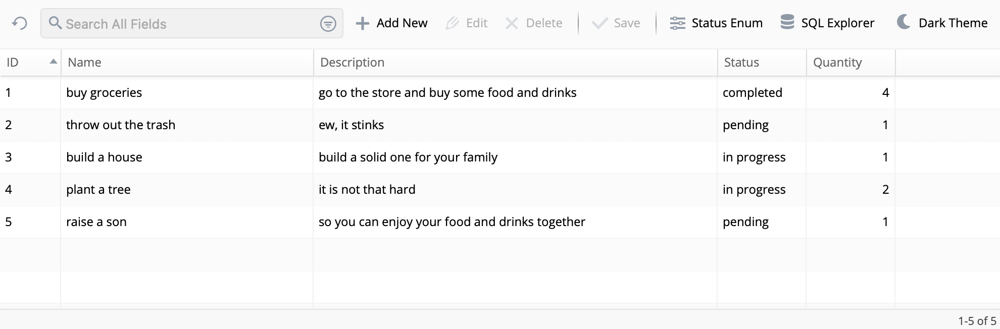
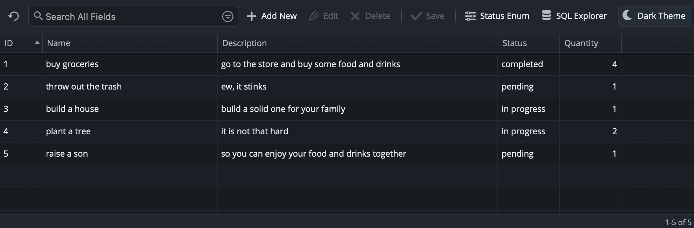
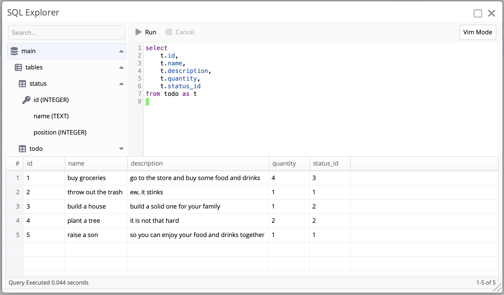

# Go bindings for w2ui

Go bindings for the [w2ui JavaScript UI Library](https://github.com/vitmalina/w2ui).

Handles request parsing, response serialization, SQL query building, and database operations for `w2grid`, `w2form`, and dropdown components running in JSON mode.

<table>
  <tr>
    <td width="50%"></td>
    <td width="50%"></td>
  </tr>
  <tr>
    <td align="center"><em>Todo grid in light theme</em></td>
    <td align="center"><em>Todo grid in dark theme</em></td>
  </tr>
</table>

- [Install](#install)
- [Packages](#packages)
- [Usage](#usage)
  - [Parsing requests and writing responses](#parsing-requests-and-writing-responses)
  - [w2sql SQL builder integration](#w2sql-sql-builder-integration)
  - [w2db database helpers](#w2db-database-helpers)
  - [w2widget built-in widgets](#w2widget-built-in-widgets)
  - [w2file file uploads](#w2file-file-uploads)
  - [w2sort array reordering](#w2sort-array-reordering)
- [Examples](#examples)
- [License](#license)

## Install

```shell
go get github.com/dv1x3r/w2go
```

## Packages

| Package    | Description                                                                                 |
| ---------- | ------------------------------------------------------------------------------------------- |
| `w2`       | Core types, request parsers, and response writers                                           |
| `w2sql`    | Translates w2ui requests into SQL (filters, sorters, limits, updates) using `go-sqlbuilder` |
| `w2db`     | High-level CRUD helpers that execute queries against a `*sql.DB` or `*sql.Tx`               |
| `w2widget` | Pre-built HTTP handlers for common UI widgets (SQL explorer)                                |
| `w2file`   | Multipart file upload parsing helpers                                                       |
| `w2sort`   | In-memory slice reordering for drag-and-drop support                                        |
| `w2lib`    | Embedded w2ui JS/CSS assets served via `embed.FS`                                           |

### Choosing between `w2sql` and `w2db`

- Use **`w2sql`** when you want full control over your queries - build them with `go-sqlbuilder`, apply w2ui filters/sorters with `w2sql`, then execute them yourself.
- Use **`w2db`** when you want to skip the boilerplate - pass your options and a `*sql.DB` or `*sql.Tx`, and it handles the rest.

Both approaches are shown in the [examples](#examples).

## Usage

`w2go` is framework-agnostic and works with `net/http`, `Echo`, `Fiber`, or any other Go HTTP framework. The snippets below use standard `net/http`.

### Parsing requests and writing responses

The `w2` package handles the JSON parsing between w2ui and your server.

**w2grid**

```go
// GET - load records
req, err := w2.ParseGetGridRequest(r.URL.Query().Get("request"))
res := w2.NewGetGridResponse(records, total)
res.Write(w)

// POST - save inline edits
req, err := w2.ParseSaveGridRequest[Todo](r.Body)
// req.Changes is a typed slice
res := w2.NewSuccessResponse()
res.Write(w, http.StatusOK)

// POST - delete records
req, err := w2.ParseRemoveGridRequest(r.Body)
// req.ID is []int
res := w2.NewSuccessResponse()
res.Write(w, http.StatusOK)

// POST - drag-and-drop reorder (single row)
req, err := w2.ParseReorderGridRequest(r.Body)
// req.RecID int, req.MoveBefore int, req.Bottom bool
res := w2.NewSuccessResponse()
res.Write(w, http.StatusOK)
```

**w2form**

```go
// GET - load record
req, err := w2.ParseGetFormRequest(r.URL.Query().Get("request"))
// req.RecID holds the record id
res := w2.NewGetFormResponse(record)
res.Write(w)

// POST - save record
req, err := w2.ParseSaveFormRequest[Todo](r.Body)
// req.Record holds the record
res := w2.NewSaveFormResponse(req.RecID)
res.Write(w)
```

**Dropdown**

```go
// GET - load options
req, err := w2.ParseGetDropdownRequest(r.URL.Query().Get("request"))
// req.Search string, req.Max int
res := w2.NewGetDropdownResponse(records)
res.Write(w)
```

**Error response**

```go
res := w2.NewErrorResponse("something went wrong")
res.Write(w, http.StatusInternalServerError)
```

**`w2.Field[T]` - tracking inline edits**

Inline grid edits only send changed fields. Wrap nullable or optional fields with `w2.Field[T]` to distinguish between "not sent", "sent as null", and "sent with a value":

```go
type Todo struct {
    ID          int              `json:"id"`
    Name        string           `json:"name"`
    Description w2.Field[string] `json:"description"`
    Quantity    w2.Field[int]    `json:"quantity"`
}
```

### w2sql SQL builder integration

`w2sql` translates w2ui request data into SQL clauses using [`go-sqlbuilder`](https://github.com/huandu/go-sqlbuilder). Field names are mapped through a whitelist to prevent injection.

```go
req, _ := w2.ParseGetGridRequest(r.URL.Query().Get("request"))

sb := sqlbuilder.Select("t.id", "t.name", "t.description").From("todo as t")

mapping := map[string]string{
    "id":   "t.id",
    "name": "t.name",
}

w2sql.Where(sb, req, mapping)   // search filters
w2sql.OrderBy(sb, req, mapping) // column sorting
w2sql.Limit(sb, req)            // pagination limit
w2sql.Offset(sb, req)           // pagination offset

query, args := sb.BuildWithFlavor(sqlbuilder.SQLite)
```

**Applying inline updates**

- `w2sql.Set` - sets the column if the field was provided; writes `NULL` if the value is empty.
- `w2sql.SetNotNull` - sets the column if the field was provided; writes the zero value if empty.

```go
for _, change := range req.Changes {
    ub := sqlbuilder.Update("todo")
    ub.Where(ub.EQ("id", change.ID))
    w2sql.SetNotNull(ub, change.Name, "name")
    w2sql.Set(ub, change.Description, "description")
    w2sql.Set(ub, change.Quantity, "quantity")
}
```

### w2db database helpers

`w2db` eliminates the boilerplate of building queries and scanning rows. Each function accepts a `*sql.DB`, `*sql.Tx`, or any value that satisfies the `QueryDB` / `ExecDB` / `QueryExecDB` interface. Every function also has a `Context` variant (e.g. `w2db.GetGridContext`) that accepts a `context.Context` as the first argument.

**w2grid**

```go
// Load records with pagination, sorting, and search
res, err := w2db.GetGrid(db, req, w2db.GetGridOptions[Todo]{
    From:           "todo as t",
    Select:         []string{"t.id", "t.name", "t.description"},
    WhereMapping:   map[string]string{"id": "t.id", "name": "t.name"},
    OrderByMapping: map[string]string{"id": "t.id", "name": "t.name"},
    Scan: func(rows *sql.Rows, record *Todo) error {
        return rows.Scan(&record.ID, &record.Name, &record.Description)
    },
})

// Save inline edits - pass a *sql.Tx to make the batch atomic
affected, err := w2db.SaveGrid(tx, req, w2db.SaveGridOptions[Todo]{
    BuildUpdate: func(change Todo) *sqlbuilder.UpdateBuilder {
        ub := sqlbuilder.Update("todo")
        ub.Where(ub.EQ("id", change.ID))
        w2sql.SetNotNull(ub, change.Name, "name")
        w2sql.Set(ub, change.Description, "description")
        return ub
    },
})

// Delete records
affected, err := w2db.RemoveGrid(db, req, w2db.RemoveGridOptions{
    From:    "todo",
    IDField: "id",
})

// Reorder rows by updating a position column - pass a *sql.Tx for consistency
affected, err := w2db.ReorderGrid(tx, req, w2db.ReorderGridOptions{
    Update:   "status",
    IDField:  "id",
    SetField: "position",
})
```

**w2form**

```go
// Load a single record by ID
res, err := w2db.GetForm(db, req, w2db.GetFormOptions[Todo]{
    From:    "todo",
    IDField: "id",
    Select:  []string{"id", "name", "description"},
    Scan: func(row *sql.Row, record *Todo) error {
        return row.Scan(&record.ID, &record.Name, &record.Description)
    },
})

// Insert a new record
lastID, err := w2db.InsertForm(db, req, w2db.InsertFormOptions{
    Into:   "todo",
    Cols:   []string{"name", "description"},
    Values: []any{req.Record.Name, req.Record.Description},
})

// Update an existing record
affected, err := w2db.UpdateForm(db, req, w2db.UpdateFormOptions{
    Update:  "todo",
    IDField: "id",
    Cols:    []string{"name", "description"},
    Values:  []any{req.Record.Name, req.Record.Description},
})
```

**Dropdown**

```go
// Load options filtered by search text
res, err := w2db.GetDropdown(db, req, w2db.GetDropdownOptions{
    From:         "status",
    IDField:      "id",
    TextField:    "name",
    OrderByField: "position",
})
```

**Transactions**

`w2db.WithinTransaction` handles begin, commit, and rollback. Pass the `*sql.Tx` directly into any `w2db` function since they all accept the `ExecDB` / `QueryExecDB` interface:

```go
// SaveGrid loops over all changes - wrap in a transaction so the batch is atomic
err := w2db.WithinTransaction(db, func(tx *sql.Tx) error {
    _, err := w2db.SaveGrid(tx, req, w2db.SaveGridOptions[Todo]{
        BuildUpdate: func(change Todo) *sqlbuilder.UpdateBuilder {
            ub := sqlbuilder.Update("todo")
            ub.Where(ub.EQ("id", change.ID))
            w2sql.Set(ub, change.Quantity, "quantity")
            return ub
        },
    })
    return err
})

// ReorderGrid issues one UPDATE per row - wrap in a transaction for consistency
err := w2db.WithinTransaction(db, func(tx *sql.Tx) error {
    _, err := w2db.ReorderGrid(tx, req, w2db.ReorderGridOptions{
        Update:   "status",
        IDField:  "id",
        SetField: "position",
    })
    return err
})
```

`WithinTransactionContext` is also available when you need to pass a `context.Context`:

```go
err := w2db.WithinTransactionContext(ctx, db, func(ctx context.Context, tx *sql.Tx) error {
    _, err := w2db.SaveGridContext(ctx, tx, req, opts)
    return err
})
```

### w2widget built-in widgets

`w2widget` provides ready-to-use HTTP handlers for common UI widgets.

**SQL Explorer**

A browser-based SQL query tool with a schema sidebar, query editor, and result grid. Useful for development and debugging.

Register the two backend endpoints:

```go
v1.HandleFunc("GET /sql",  w2widget.SQLiteSchemaHTTPHandler(db))
v1.HandleFunc("POST /sql", w2widget.SQLExecHTTPHandler(db))
```

Mount the frontend widget from `w2ui.widgets.js`:

```js
import { createSqlExplorerLayout } from "/lib/w2ui.widgets.js";
const sqlExplorer = createSqlExplorerLayout({ url: "/api/v1/sql" });
sqlExplorer.render("#container");
```

Features:

- Schema sidebar with database/table/column tree
- Query editor with `Tab` indentation and `Alt+Enter` to execute
- Execute selection or full query
- Cancel in-flight queries
- Result grid with row count and elapsed time



> **Note:** `SQL Explorer` executes arbitrary SQL from the client. Do not expose it in production!

If you prefer to handle the HTTP layer yourself, use the lower-level functions directly:

```go
res, err := w2widget.SQLExecQuery(ctx, db, query)
schema, err := w2widget.SQLiteSelectSchema(ctx, db)
```

### w2file file uploads

`w2file` provides helpers for parsing multipart file uploads sent by the `w2upload` helper in `w2ui.helpers.js`.

```go
// Parse files[] from a multipart/form-data request (default 32 MB limit)
headers, err := w2file.ParseMultipartFiles(r)

// Custom memory buffer and per-file size limit
headers, err := w2file.ParseMultipartFilesWithOptions(r, w2file.ParseMultipartFilesOptions{
    Memory:        64 << 20, // 64 MB in-memory buffer
    MaxUploadSize: 10 << 20, // 10 MB per file limit
})

for _, h := range headers {
    f, _ := h.Open()
    defer f.Close()
    // process file...
}
```

### w2sort array reordering

`w2sort.ReorderArray` applies a drag-and-drop reorder request to a slice of IDs in memory.

```go
req, _ := w2.ParseReorderGridRequest(r.Body)

ids := []int{1, 2, 3, 4, 5} // current order from the database

if err := w2sort.ReorderArray(ids, req); err != nil {
    // req.RecID not found in the slice
}

// ids now reflects the new order - persist it to the database
```

## Examples

Two complete CRUD demos are included, both using an in-memory SQLite database:

| Example                              | Approach                                           |
| ------------------------------------ | -------------------------------------------------- |
| [`examples/w2db`](./examples/w2db)   | Uses `w2db` helpers, includes SQL explorer widget  |
| [`examples/w2sql`](./examples/w2sql) | Uses `w2sql` + raw `database/sql` for full control |

```shell
go run ./examples/w2db/main.go
# or
go run ./examples/w2sql/main.go
```

Open `http://localhost:3000` in your browser.

Both examples cover a full todo CRUD app with inline grid editing, a form popup, a status dropdown, and drag-and-drop reordering. The `w2db` example also includes the SQL explorer widget.

## License

Licensed under the MIT license.
